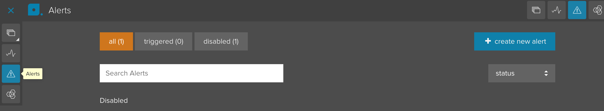
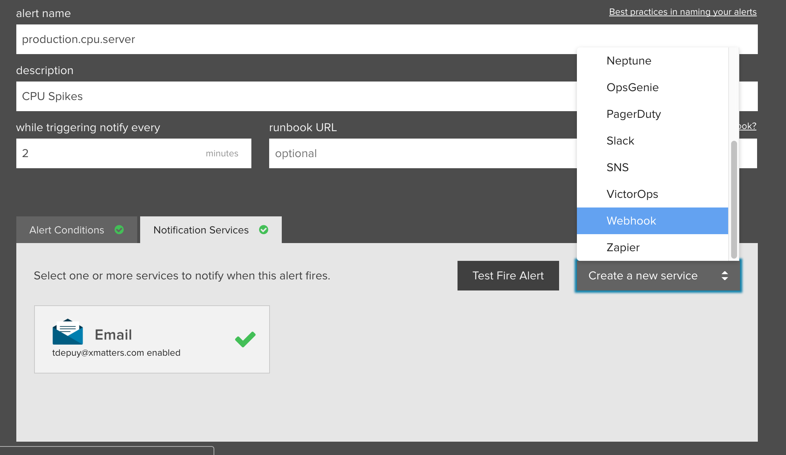
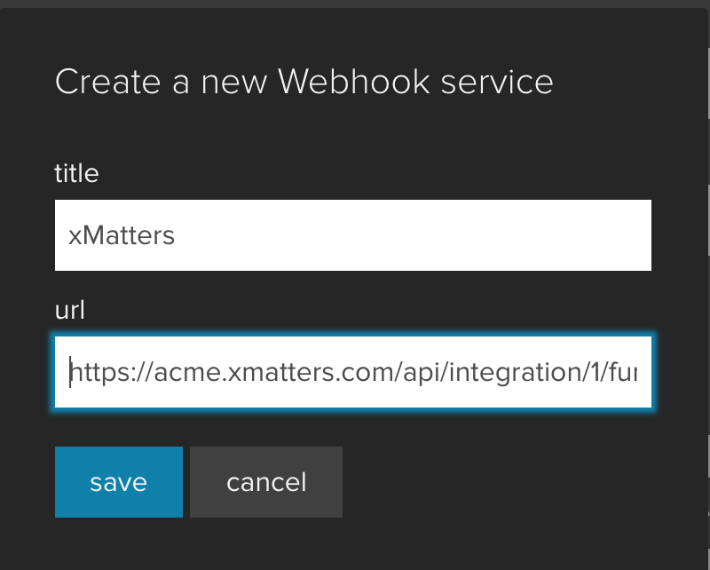

# Librato
[Librato](http://www.solarwinds.com/librato) aggregates cloud metrics into real-time monitoring dashboards for instant visibility. 

This integration extends the alerting capability of Librato to leverage the xMatters communications platform and toolchain capabilities. 

# Pre-Requisites
* [Librato](http://www.solarwinds.com/librato) account
* xMatters account - If you don't have one, [get one](https://www.xmatters.com)!

# Files
* [LibratoCommPlan.zip](LibratoCommPlan.zip) - Communications Plan containing the inbound integration and form templates

# How it works
An alert fires a webhook to the xMatters integration builder. The integration builder parses the incoming json and builds the event, then fires the event to notifiy the default recipients. Alternatively [subscriptions](http://help.xmatters.com/OnDemand/userguide/receivingalerts/subscriptions/howtousesubscriptions.htm) can be set up to notify the desired parties. 

# Installation

## xMatters set up
1. Login as a Company Supervisor and navigate to the Developer tab. 
2. Import the [LibratoCommPlan.zip](LibratoCommPlan.zip) file and update the access permissions to include the `REST Web Services User` role. 

Copy inbound url

Set default recipient

FINISHME

## Librato set up
1. Login to Librato and navigate to Alerts

<kbd>
	
</kbd>
2. Click Create New Alert and enter the appropirate information Alert name, description, and runbook url. Then add the Alert conditions the alert should be triggered for. 
3. On the Notification Services tab click the Create New Service drop down and scroll down to Webhook

<kbd>
	
</kbd>

4. Enter a title and in the url field, paste in the Inbound Integration url copied from xMatters above. 

<kbd>
	
</kbd>

5. Click Save. Send a test alert to make sure everything is working.

# Testing
Do some actions in your application or infrastructure that will trigger the alert conditions set up in the Alert. This will fire a webhook into the inbound integration builder script and an event will be created, targeting the default recipients. 

# Troubleshooting
The first place to start is in the Alert, on the Notification Services tab, click the `Test Fire Alert` button. Read the Activity Stream for the `Inbound from Librato` integration script and check for any errors. If nothing is making it to the activity stream, verify the url is correct, paying special attention to the `apiKey` at the end. If the webhook is successful and activity is occuring in the Activity Stream, then review for any errors posting the event. 

